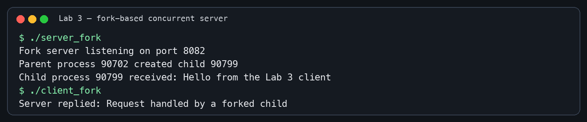

# Lab 1: TCP Client–Server Communication

**Author:** Aastha

## Objective

Implement a connection-oriented TCP client and server using BSD sockets.

## Build and run

```bash
clang -Wall -Wextra -pedantic tcp_server.c -o tcp_server
clang -Wall -Wextra -pedantic tcp_client.c -o tcp_client
./tcp_server
```

Run `./tcp_client` in a second terminal.

## Result

The client connects through the loopback interface, sends a message, and receives a reply from the server.


